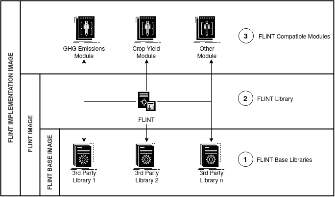

.. FlintUserGuides documentation master file, created by
   sphinx-quickstart on Thu Dec 17 21:16:20 2020.
   You can adapt this file completely to your liking, but it should at least
   contain the root `toctree` directive.

************
Build Guides
************

.. _build_introductory_guide:

Overview
========

.. _introductory_guide_overview:

.. sidebar:: Quick Architectural Reference

   .. image:: ../_static/FLINT-Third-Party-Libs-Icon.png

   A **FLINT Base Library** is a Third Party Open Source library that the FLINT depends upon. 

   .. image:: ../_static/FLINT-Icon.png   

   The **FLINT** is an open-source platform that provides tools that integrate multiple data types 
   with FLINT-compatible modules in order to produce spatially-explicit calculations of greenhouse gas emissions and other variables.

   .. image:: ../_static/FLINT-Modules-Icon.png

   A **FLINT-Compatible Module** is a discrete software package that is attached to the FLINT to enhance the FLINT's functionality (e.g. data aggregation and reporting) or make specific calculations (e.g. emissions).
   
   .. image:: ../_static/FLINT-Implementation-Icon.png

   A **FLINT Implementation** is a unique configuration of modules attached to the FLINT together with additional data management and output processes. Currently, there are 3 main flavours of FLINT Implementations in production: 
   The SLEEK-FLINT, GCBM, and `FLINTpro <https://flintpro.com/>`_.

   
In this section, we will look at the steps needed to successfully build FLINT Docker Images:

* **First, we will look at the steps needed to build a FLINT Base Image**: 
  
  *This image extends a Linux Base Image (Ubuntu Bionic) and adds to it a defined set of libraries that the FLINT depends upon*.

* **Next, we will look at the steps needed to build a FLINT Image**: 
  
  *This image extends the FLINT Base Image and adds to it the core FLINT Library*.

* **Finally, we will look at the steps needed to build a FLINT Implementation Image**: 
  
  *This image extends the FLINT Image and adds to it FLINT-Compatible Modules*.

-----------------------------------------------

Prerequisites
=============
.. _introductory_guide_prerequisites:

Aptitude
   * A conceptual understanding of Docker
   * A basic ability to execute commands in a shell environment 

Hardware
   * Intel Core i7, 8 Core Processor
   * 16GB Of Memory
   * 1TB Hard Drive
   
Software
   * Latest Version Of Docker Engine Installed On Your Workstation
   * Latest Version Of GIT Installed On Your Workstation  

-----------------------------------------------

Contents
========

.. _introductory_guide_contents:

.. toctree::
   :maxdepth: 2

   1. FLINT Base Image <./moja-base-libraries>
   2. FLINT Library Image <./moja-flint-library>
   3. FLINT Implementation Image <./moja-flint-implementation>
 