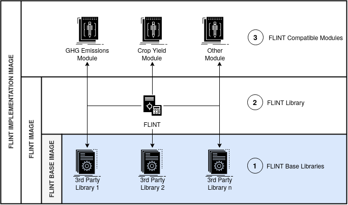
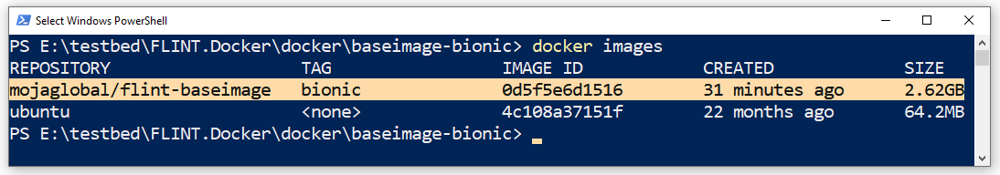

.. First of a 3 part series that shows how to build a Flint Implementation Docker Image 

*************************
1. FLINT Base Image Build
*************************

.. _building_flint_base_image_guide:

.. toctree::
   :maxdepth: 2
   :caption: Contents:

1.1. Overview
=============

.. _building_flint_base_image_guide_overview:

.. _a link: https://domain.invalid/

In this guide, we'll explore how to build a **Moja FLINT Base Image** for Docker environments.

-----

1.1. Prerequisites
==================

.. _building_flint_base_image_guide_prerequisites:

These instructions assume that we've met the requirements laid down in the :ref:`Introductory Guide <introductory_guide_prerequisites>`.

-----

1.3. Steps
==========

.. _building_flint_base_image_guide_steps:

Let's begin by cloning the **FLINT.docker** repository into our workstation:

.. code-block::

   git clone https://github.com/moja-global/FLINT.Docker.git 

    
Next, let's change our working directory to the directory containing the Base Image's Dockerfile:

.. code-block::

   cd FLINT.Docker/docker/baseimage-bionic
    

Now let's build our FLINT Base Image using the following command:

.. Attention:: This process could take up to 1.5 hours to complete

.. code-block::

   docker build --build-arg NUM_CPU=4 -t mojaglobal/flint-baseimage:bionic .   

-----

1.4. Results
============

.. _building_flint_base_image_guide_results:

At this point we should inspect our current Docker Images using the command below:

.. code-block::

   docker images 

If all went well we should see the **mojaglobal/flint-baseimage** image, with the correct size, listed.

