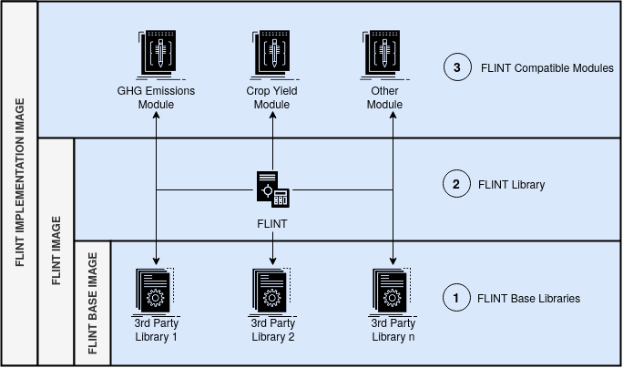
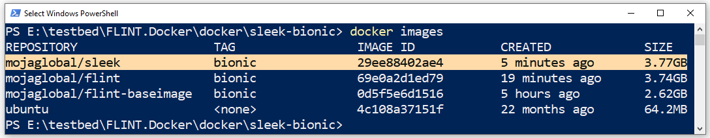

.. Third of a 3 part series that shows how to build a Flint Implementation Docker Image 

***********************************
3. FLINT Implementation Image Build
***********************************

.. _building_flint_implementation_image_guide:

.. toctree::
   :maxdepth: 2
   :caption: Contents:

3.1. Overview
=============

.. _building_flint_implementation_image_guide_overview:

In this guide, we'll explore how to build a **FLINT Implementation Image** from source using Docker.

-----

3.3. Prerequisites
==================

.. _building_flint_implementation_image_guide_prerequisites:

These instructions assume that we've successfully  :ref:`built the FLINT Image <building_flint_image_guide>`.

-----

3.3. Steps
==========

.. _building_flint_implementation_image_guide_steps:

Let's begin by cloning the **FLINT.Docker** repository into our workstation:

.. Note:: This step is not necessary if we still have the **FLINT.Docker** repository from :ref:`Build Step 1.3 <building_flint_base_image_guide_steps>`

.. code-block::

   git clone https://github.com/moja-global/FLINT.Docker.git 

Next, let's change our working directory to one containing an Implementation Image's Dockerfile:

.. Important:: 
   Access to FLINT Implementations Repositories is usually **restricted to a list of pre-approved users**. 
   *This is because FLINT modules may be open-source or proprietary depending on their application context*. 

   To proceed, we thus need to make sure that we have access to the target FLINT Implementation Repository e.g. SLEEK 
   and that we can connect to it via a Github Access Token. *If this is not the case, then, we should write to "info@moja.global" for assistance*.

.. code-block::

   cd FLINT.Docker/docker/sleek-bionic

Now let's build our FLINT Implementation Image using the following command:

.. Attention:: This process could take up to 1.5 hours to complete

.. code-block::

   docker build --build-arg BUILD_TYPE=RELEASE \
                --build-arg NUM_CPU=4 \
                --build-arg GITHUB_AT=[Your Personal Access Token] \
                --build-arg SLEEK_BRANCH=release/sleek/1_0_6 \
                 -t mojaglobal/sleek:bionic .

-----

3.4. Results
============

.. _building_flint_implementation_image_guide_results:

At this point we should inspect our current Docker Images using the command below:

.. code-block::

   docker images 

If all went well we should see the **mojaglobal/sleek** image, with the correct size, listed.

