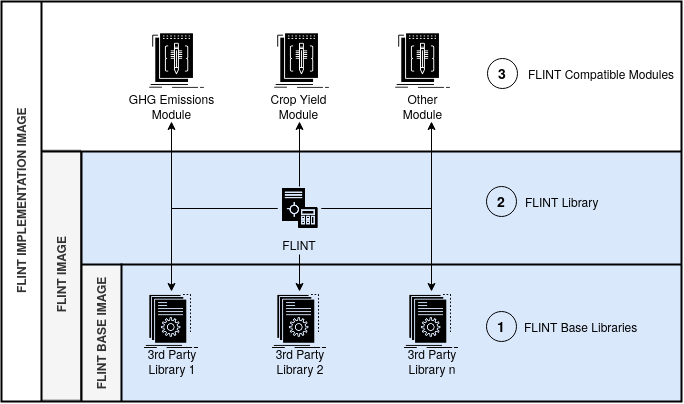
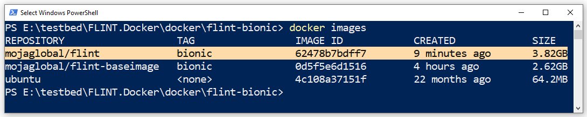

.. Second of a 3 part series that shows how to build a Flint Implementation Docker Image 

********************
2. FLINT Image Build
********************

.. _building_flint_image_guide:

.. toctree::
   :maxdepth: 2
   :caption: Contents:

2.1. Overview
=============

.. _building_flint_image_guide_overview:

In this guide, we'll explore how to build a **Moja FLINT Image** for Docker environments.

-----

2.2. Prerequisites
==================

.. _building_flint_image_guide_prerequisites:

These instructions assume that we've successfully  :ref:`built the FLINT Base Image <building_flint_base_image_guide>`.

-----

2.3. Steps
==========

.. _building_flint_image_guide_steps:

Let's begin by cloning the **FLINT.Docker** repository into our workstation:

.. Note:: This step is not necessary if we still have the **FLINT.Docker** repository from :ref:`Build Step 1.3 <building_flint_base_image_guide_steps>`

.. code-block::

   git clone https://github.com/moja-global/FLINT.Docker.git 

Next, let's change our working directory to the directory containing the FLINT Image's Dockerfile:

.. code-block::

   cd FLINT.Docker/docker/flint-bionic

Now let's build our FLINT Image using the following command:

.. Attention:: This process could take up to 1.5 hours to complete

.. code-block::

   docker build --build-arg BUILD_TYPE=RELEASE \
                --build-arg NUM_CPU=4 \
                --build-arg FLINT_BRANCH=develop \
                 -t mojaglobal/flint:bionic .

-----

2.4. Results
============

.. _building_flint_image_guide_results:

At this point we should inspect our current Docker Images using the command below:

.. code-block::

   docker images 

If all went well we should see the **mojaglobal/flint** image, with the correct size, listed.

